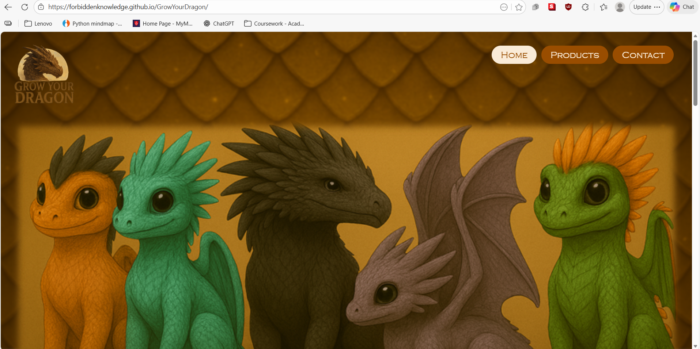

# E-Commerce Website (HTML & CSS)

## Project Overview
This project is a static e-commerce website created using HTML5 and CSS3.
It demonstrates page structure, navigation, layout, and responsive design.
It is a project I made for my university assignment, with a fun theme around dragon toys that require water to grow.
Disclaimer: All the images and products are fictitious and are only meant to be there as an example. Also, all images are AI-generated using Co-Pilot.
Very minimal use of JavaScript. 

## Website Pages
- Home page
- Products page
- Contact page

## Technologies Used
- Sublime Text Editor
- HTML5
- CSS3
- JS
- GitHub Pages

## Live Website
[https://forbiddenknowledge.github.io/GrowYourDragon/]

## Screenshots

## Author

Trishna S. Marday – University Project From Module – CST0400 – 11th February 2026
